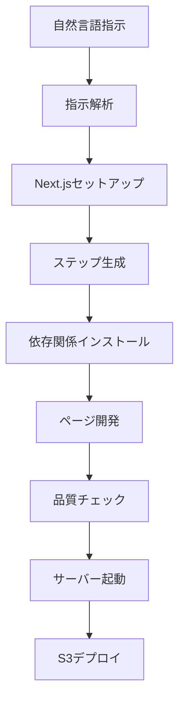

# Web Development Agent

自然言語指示から静的Webサイトを自動生成するMCPサーバーです。Next.jsベースのWebサイトを生成し、S3への自動デプロイも可能です。

## 🚀 概要

このシステムは、ユーザーの自然言語による指示を受け取り、以下の処理を自動実行します：

1. **指示解析**: 自然言語指示をWebサイト構造に変換
2. **Next.jsプロジェクト生成**: 自動的にプロジェクトをセットアップ
3. **ページ開発**: 各ページのコンポーネントとスタイルを生成
4. **品質管理**: 生成されたコードの品質をレビュー
5. **自動デプロイ**: S3静的ホスティングへの自動デプロイ

## ✨ 主要機能

### MCPツール
- **create_website**: 自然言語指示からWebサイトを自動生成
- **deploy_to_s3**: Next.jsプロジェクトをS3に静的サイトとしてデプロイ
- **check_s3_deployment**: S3デプロイメントの状態確認

### 自動生成される要素
- Next.jsプロジェクト構造
- レスポンシブレイアウト（layout.tsx）
- 各ページコンポーネント（page.tsx）
- CSSモジュール（*.module.css）
- グローバルスタイル（globals.css）
- Tailwind CSS設定

### 技術スタック
- **Framework**: Next.js 13+ App Directory
- **Styling**: TailwindCSS + CSS Modules
- **Server**: FastMCP (Model Context Protocol)
- **AI/ML**: Google Gemini API, LangChain
- **Cloud**: AWS S3 (静的ホスティング)
- **Architecture**: Multi-agent system

## 🏗️ アーキテクチャ

### マルチエージェントシステム
本プロジェクトは各開発フェーズに特化したエージェントを使用：

- **指示解析エージェント** (`agents/instruction_analysis.py`)
  - ユーザー要求の解析と理解
  - デザイン方針と機能要件の抽出

- **ステップ生成エージェント** (`agents/step_generation.py`)
  - 品質管理付き開発ワークフローの計画
  - 重要な失敗に対する3回リトライ制限の実装
  - ライブラリ依存関係の管理

- **ページ開発エージェント** (`agents/page_development.py`)
  - 個別ページとコンポーネントの開発
  - 適切なNext.jsパターンと規約の保証

- **レビューエージェント** (`agents/review_page.py`)
  - 多層コード検証
  - 品質基準の強制（80点以上のスコア要求）

- **実行エージェント** (`agents/execution.py`)
  - プロジェクトセットアップとサーバー管理
  - Next.js開発サーバーのライフサイクル管理

- **ビルドエージェント** (`agents/build_agent.py`)
  - Next.jsプロジェクトのビルド処理

- **S3デプロイエージェント** (`agents/s3_deploy_agent.py`)
  - AWS S3への静的サイトデプロイメント

### 品質管理システム
`agents/prompts.py`の特化プロンプトによる高度な検証：

#### インデックスページ検証 (`INDEX_REVIEW_PROMPT`)
- メタデータエクスポートの検証
- ナビゲーションリンクの確認
- TailwindCSSクラスの検証
- サーバーコンポーネントの準拠

#### レイアウト検証 (`LAYOUT_REVIEW_PROMPT`)
- Next.js 13+レイアウト構造
- 共有ヘッダー/ナビゲーション要件
- CSS @applyディレクティブの検証
- カスタムクラス定義チェック

#### 個別ページ検証 (`DEVELOP_PAGE_REVIEW_PROMPT`)
- ヘッダー継承の検証
- Module.css統合
- 外部リソース制限
- JSX構文検証

### ワークフロー


## 🛠️ インストール

### 前提条件
- Node.js 18+ 
- Python 3.8+
- Google API key (Gemini)

### セットアップ
1. **リポジトリのクローン**
   ```bash
   git clone https://github.com/shark-bot-0118/web-dev-mcp-server
   cd web-dev-mcp-server
   ```

2. **Python依存関係のインストール**
   ```bash
   pip install -r requirements.txt
   ```

3. **Node.js依存関係のインストール**
   ```bash
   npm install
   ```

4. **環境設定**
   `.env`ファイルを作成：
   ```bash
   GOOGLE_API_KEY=your_google_api_key
   
   # AWS設定（S3デプロイ用）
   AWS_ACCESS_KEY_ID=your_aws_access_key
   AWS_SECRET_ACCESS_KEY=your_aws_secret_key
   AWS_DEFAULT_REGION=ap-northeast-1
   
   # オプション設定
   OUTPUT_DIR=static_site_output
   TEMPLATE_DIR=templates
   LOG_FILE=app.log
   ```

## 🚀 使用方法

### MCPサーバーの起動
```bash
python main.py
```

### Webサイトの生成
`create_website`ツールを自然言語指示で使用：

```python
# 例：企業サイトの指示
user_instruction = "技術系企業のコーポレートサイトを作成してください。ホーム、企業概要、サービス、お問い合わせページが必要です。モダンなブルー系のカラースキームでプロフェッショナルなタイポグラフィを使用してください。"
```

### ワークフロープロセス
1. **指示解析** - 要件とデザイン設定の理解
2. **プロジェクトセットアップ** - 適切な構造でNext.jsプロジェクトを作成
3. **ステップ生成** - 品質検証付きの開発ステップ計画
4. **ライブラリインストール** - 必要なnpmパッケージのインストール（Next.jsデフォルト除く）
5. **開発** - 継続的な品質チェック付きページ生成
6. **サーバー起動** - `http://localhost:3000`で開発サーバーを起動

### S3デプロイ
```python
# プロジェクトをS3にデプロイ
deploy_result = deploy_to_s3("nextjs_site_123456", "my-website-bucket")

# デプロイ状態確認
status = check_s3_deployment("my-website-bucket")
```

## 📁 プロジェクト構造

```
web_development_agent/
├── agents/                    # マルチエージェントシステム
│   ├── instruction_analysis.py  # 指示解析
│   ├── step_generation.py       # ステップ生成
│   ├── page_development.py      # ページ開発
│   ├── review_page.py           # レビュー・品質管理
│   ├── execution.py             # 実行管理
│   ├── build_agent.py           # ビルド処理
│   ├── s3_deploy_agent.py       # S3デプロイ
│   └── prompts.py               # 品質管理プロンプト
├── graph/
│   ├── workflow.py              # メインワークフロー
│   └── s3_deploy_workflow.py    # S3デプロイワークフロー
├── tools/
│   └── setup_nextjs_project.py # Next.jsプロジェクトセットアップ
├── templates/                   # HTMLテンプレート
├── static_site_output/          # 生成されたプロジェクト
├── sample_page/                 # サンプルページ
├── test/                        # テストスイート
├── config.py                    # 設定管理
├── logger.py                    # ロギングシステム
└── main.py                      # MCPサーバーエントリーポイント
```

### 生成される出力
```
static_site_output/
└── nextjs_site_[random_id]/
    ├── app/
    │   ├── layout.tsx           # メインレイアウト
    │   ├── globals.css          # グローバルスタイル
    │   ├── page.tsx             # ホームページ
    │   ├── home.module.css      # ホームページスタイル
    │   ├── about/
    │   │   ├── page.tsx
    │   │   └── about.module.css
    │   └── contact/
    │       ├── page.tsx
    │       └── contact.module.css
    ├── package.json
    ├── tailwind.config.ts
    └── next.config.mjs
```

## 🎯 品質基準

### CSS/TailwindCSS検証
システムが検出・防止する一般的なビルドエラー：

- **禁止カスタムクラス**: `text-primary`, `bg-light-gray`, `selection:bg-accent-teal`
- **無効な@apply使用**: @applyディレクティブでのCSS変数
- **未定義色名**: 非標準TailwindCSSカラークラス
- **構文エラー**: ビルドを破壊する不正なCSS

### スコアリングシステム
- **80点以上**: コンポーネント承認に必要
- **自動失敗**: 未定義カスタムクラス、ナビゲーションエラー、構文問題
- **3回リトライ制限**: 重要コンポーネントは最大3回の試行後ワークフロー終了

### Next.jsベストプラクティス
- **App Directory構造**: Next.js 13+パターン
- **サーバーコンポーネント**: デフォルトでサーバーサイドレンダリング
- **適切なインポート**: 正しいNext.jsモジュール使用
- **SEO最適化**: メタデータエクスポートとセマンティックHTML

## 🔧 設定

### 環境変数
| 変数 | 説明 | デフォルト |
|-----|------|-----------|
| `GOOGLE_API_KEY` | Google Gemini API キー | 必須 |
| `AWS_ACCESS_KEY_ID` | AWS アクセスキー（S3デプロイ用） | オプション |
| `AWS_SECRET_ACCESS_KEY` | AWS シークレットキー（S3デプロイ用） | オプション |
| `AWS_DEFAULT_REGION` | AWS リージョン | `ap-northeast-1` |
| `OUTPUT_DIR` | 生成プロジェクトディレクトリ | `static_site_output` |
| `TEMPLATE_DIR` | テンプレートディレクトリ | `templates` |
| `LOG_FILE` | ログファイル場所 | `app.log` |

### ロギング
設定可能レベルの包括的ロギングシステム：
- **INFO**: ワークフロー進行と主要操作
- **DEBUG**: 詳細実行情報
- **ERROR**: エラー追跡とデバッグ

## 🧪 テスト

```bash
# 全テスト実行
python test/run_all_tests.py

# 個別テスト実行
python -m pytest test/test_build_agent.py
python -m pytest test/test_s3_deploy_agent.py
python -m pytest test/test_main_tools.py
```

## 🐛 トラブルシューティング

### 一般的な問題

**CSSビルドエラー**
- システムが未定義TailwindCSSクラスを自動防止
- 特定の検証失敗は`app.log`を確認
- 現在の検証ルールは`agents/prompts.py`をレビュー

**サーバー起動失敗**
- Node.jsバージョン確認（18+必須）
- ポート3000の可用性確認
- npmパッケージインストールログをレビュー

**品質管理失敗**
- 3回失敗したコンポーネントはワークフロー終了
- ログで検証スコア確認
- 品質基準に対する生成コードレビュー

**Gemini APIレート制限**
- 指数バックオフとリトライロジック実装済み
- ログでAPI呼び出し状況確認

## 🤝 貢献

1. **コード品質**: 既存パターンと検証ルールに従う
2. **テスト**: 様々な指示タイプと複雑さレベルでテスト
3. **ドキュメント**: 必要に応じてプロンプトと検証ルールを更新
4. **エラーハンドリング**: 品質管理システムに特定エラーパターンを追加

## 📄 ライセンス

このプロジェクトはMITライセンスの下でライセンスされています。

## 🔗 関連プロジェクト

- [FastMCP](https://github.com/jlowin/fastmcp) - MCPサーバーフレームワーク
- [Next.js](https://nextjs.org/) - 本番用Reactフレームワーク
- [TailwindCSS](https://tailwindcss.com/) - ユーティリティファーストCSSフレームワーク
- [LangGraph](https://langchain-ai.github.io/langgraph/) - ワークフロー管理フレームワーク
